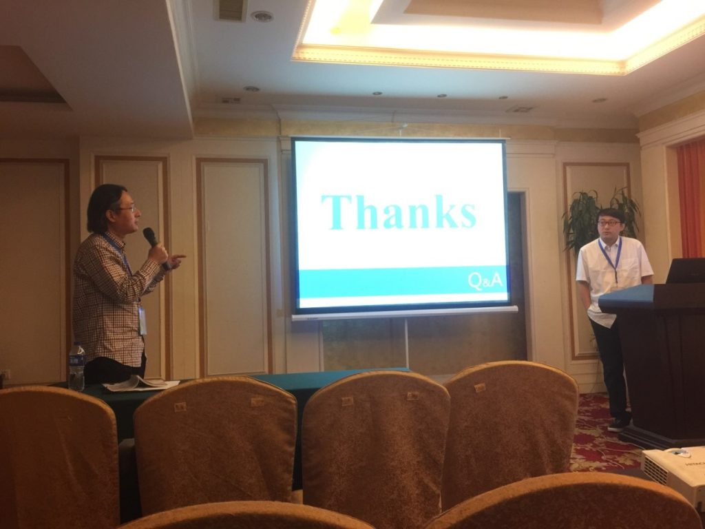

2016年6月3日至5日，实验室何苯副教授赴南昌参加了WAIM2016(The 17th International Conference on Web-Age Information Management)国际会议，并做了题为“A Set-based Training Query Classification Approach for Twitter Search”的分会报告，受到与会者的关注。
