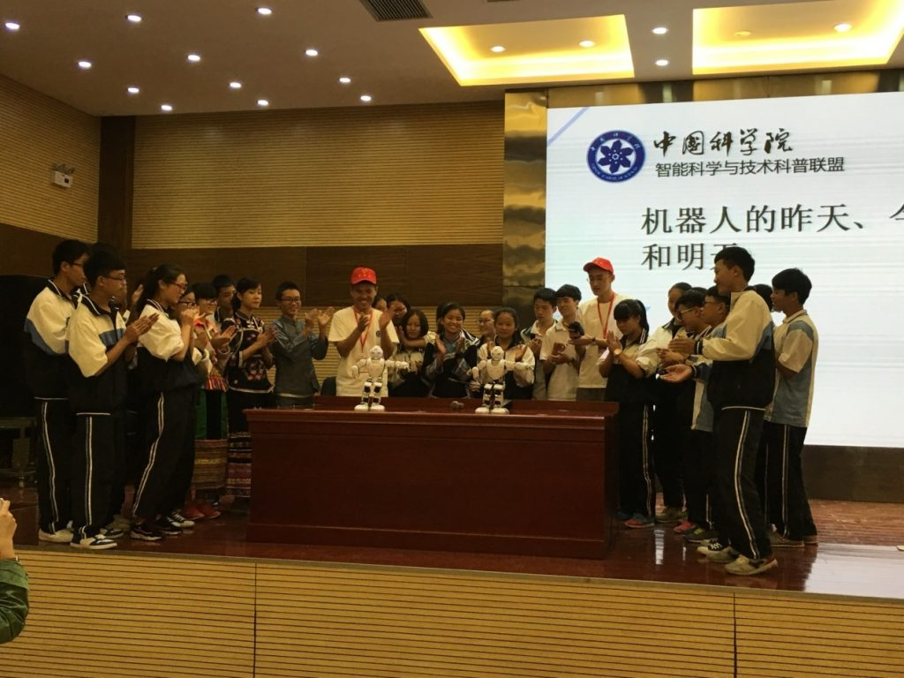

受贵州省委组织部、省科协、黔西南州委、州政府邀请，中科院智能科普联盟联合昆明分院一行20余名科普志愿者于2016年9月5日抵达贵州黔西南州（金州），开展为期一周的科普志愿行活动,实验室徐俊刚老师和王琦同学作为国科大的代表参加了此次活动。

9月6日上午，“创新放飞梦想，科技引领未来”黔西南州2016年全国科普日暨中国科学院智能科学与技术科普联盟科普志愿金州行活动启动仪式在兴义一中隆重举行。黔西南州委常委、组织部长顾先林同志致辞并宣布活动启动，贵州省科协巡视员路贵同志讲话，表达对中科院智能科普联盟入黔开展科普活动的欢迎和感谢。中科院自动化所副所长战超同志代表中科院智能科普联盟讲话，启动仪式由州人大副主任韦琼同志主持。

参加启动仪式的智能科普联盟成员单位包括自动化所、合肥物质院、重庆智能院、中科大、计算所和国科大六家成员单位。上午，全体志愿者在兴义一中分别进入主会场和六个班级，同步开展科普讲座和项目演示；下午，走进兴义八中和兴义民族师范学院等五个会场开展科普活动。6日全天，联盟志愿者开展科普报告和项目演示累计19场，受众人数近2000人。

国科大徐俊刚老师在主会场做了《机器人的昨天、今天、明天》的科普报告，徐老师以机器人的发展历史为切入点，讲解了机器人在不同领域的广泛应用以及机器人未来的发展方向。徐老师在报告中多次与在场学生互动，使同学们对机器人有了更深入的体会和了解。

在接下来几天科普活动中，联盟各成员单位分别为黔西南州师生进行了多次科学讲座和项目展示。国科大志愿者王琦同学为中小学学生们带来了“数据之美”项目，以身边存在的数据为切入点，让学生感觉数据无处不在，介绍了当今热门的大数据和数据挖掘方向，点燃了学生的好奇心。随后对现有的数据库软件、数据库软件的发展历史和数据库的增删改查操作进行了阐述。通过“观电影-共合作-找实体、属性及其联系”的方式，加强了学生对数据库的理解，激发了学生勇于实践应用的积极性。

此次“中国科学院智能科普联盟科普金州行”活动历时一周、深入到黔西南兴义、安龙、兴仁等5个市县，最大限度地把科学的种子播撒在黔西南的沃土上，让当地青少年零距离感受到科技的魅力，让他们树立科学理念，鼓励他们学习和钻研科学文化知识，将来用科技知识更好地建设祖国、建设家乡。

活动新闻链接：
1. 人民网：http://qxn.people.com.cn/n2/2016/0907/c362415-28966168.html
2. 贵州省科学技术协会：http://www.gzast.org/xhxw/zyxw/4522.shtml
3. 中国科学院：http://www.cas.cn/kx/gz/201609/t20160909_4574348.shtml

