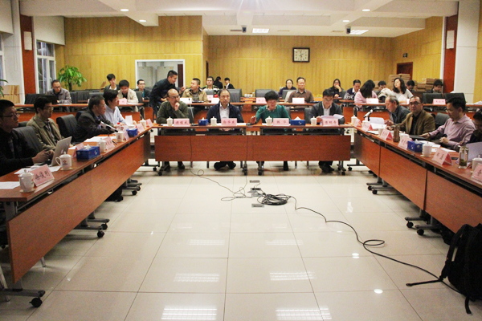

2016年10月18日，实验室徐俊刚老师参加的2016年国家重点研发计划“云计算与大数据”重点专项“科学大数据管理系统”项目在中国科学院计算机网络信息中心举行启动会。中国科学院院士郭华东、中国人民大学教授杜小勇、国家天文台空间部主任魏建彦、科技部高技术中心信息处处长傅耀威、中科院条财局信息化工作处处长陈明奇、中国科学院计算机网络信息中心党委书记、副主任韩华、副主任迟学斌等专家参加了会议。 实验室徐俊刚老师作为项目骨干，参加了本次会议。

中国科学院计算机网络信息中心新闻链接：http://www.cnic.cn/xwdt/zhxw/201610/t20161020_4682259.html

