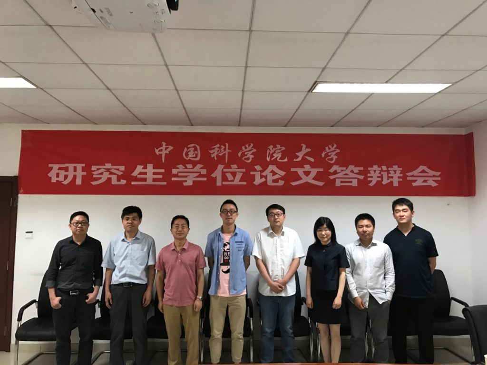

2017年5月11日，实验室在国科大中关村校区举行了王国路、杨陈皓同学的硕士论文答辩会，答辩会主席由中国科学院信息工程研究所王斌研究员担任，答辩会成员包括徐俊刚、王宁、韩先培、何苯，答辩会秘书李鹏飞，各位专家听取了两位同学的论文报告，经讨论并无记名投票，一致同意通过两位同学的硕士论文答辩，并建议授予硕士学位。
对两位同学表示祝贺！

答辩会会后合影： 
封面左起依次为：叶正、何苯、王斌、王国路、徐俊刚、王宁、韩先培、李鹏飞

