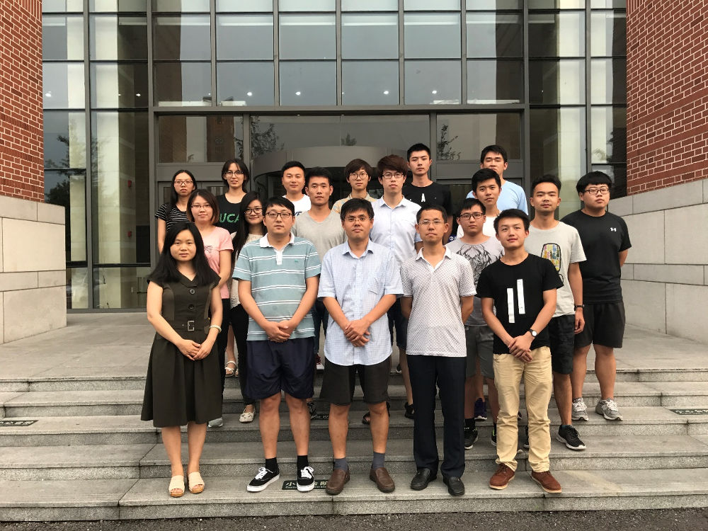

2017年7月25日，实验室在国科大国际会议中心召开了实验室研讨会，就实验室的科研工作、未来发展进行了研讨。参会的老师有实验室徐俊刚教授、何苯副教授、北京理工大学张文耀副教授、国科大刘慧老师，参会的同学有实验室博士研究生李鹏飞、李帅敏，硕士研究生王琦、刘仁峰、范洋、黄珊珊（客座）、刘昊、刘思远、边靖辰、高红（客座），参会的还有实验室聘用人员李航航以及来自山东师范大学的王天一、青岛理工大学张明睿、施文强和石油大学的兰阳四位参加国科大大创计划项目的同学。

首先，徐俊刚教授对实验室现状进行了介绍，对实验室的研究课题、在研项目进行了说明，并结合当前全球研究热点，对实验室的未来发展做了详细的规划；其次，实验室各位同学和工作人员对自己的研究工作进行了介绍，并进行了讨论，北京理工大学的张文耀老师也对实验室的研究工作和发展提出了自己的建议；最后，徐俊刚教授做了关于机器学习理论和应用的总结报告。

通过本次研讨会，更加明确了实验室的发展方向，并制订了到2020年的发展计划，对实验室的发展起到了很好的促进作用。

