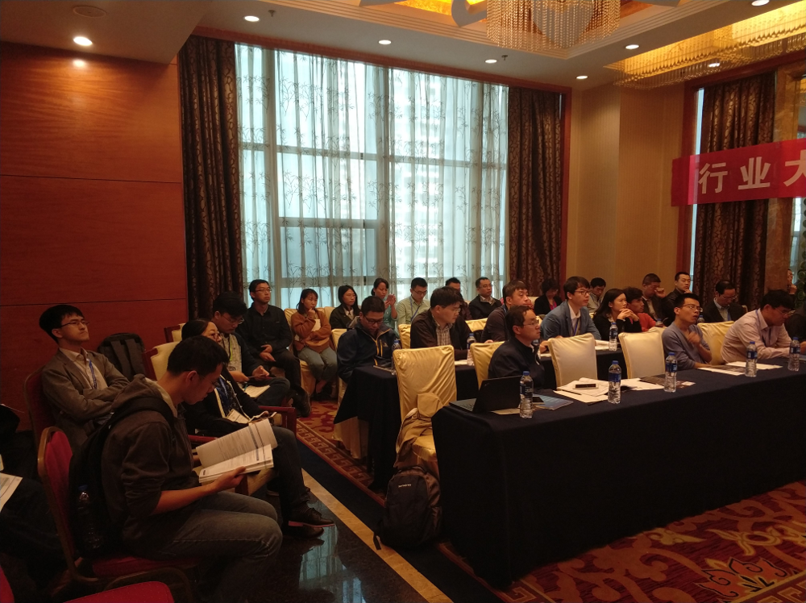

2017年10月19-21日，由中国计算机学会主办，中国计算机学会高性能计算专业委员会、中国科学技术大学共同承办、北京并行科技股份有限公司协办的“2017年全国高性能计算学术年会”（HPC China 2017）在合肥召开, 会议网址: http://hpcchina2017.csp.escience.cn/dct/page/1。大会主题为“应用驱动，生态共建”。实验室徐俊刚教授及硕士生刘仁峰参加了此次高性能计算学术年会。会议期间，徐俊刚教授组织并主持了“行业大数据论坛”，邀请学术界和工业界的多位专家学者、资深从业人员作了主题报告，并围绕主题展开了热烈的讨论，促进了大数据领域的技术交流与合作。

**行业大数据论坛简介：** 
全球数据在迅猛增长，IDC预测到2020年，全球数据将达到44ZB。在互联网大数据获得巨大价值之后，行业大数据应用开始进入爆发期，包括政务、金融、医疗、智能制造、公共安全等行业领域。本论坛聚焦行业大数据，从行业数据采集、存储、处理、分析、可视化及应用效果等方面研讨行业大数据处理技术和应用案例，以促进行业大数据领域的技术交流和合作。

**行业大数据论坛报告及讲者：** 
**报告1：雷达气象大数据机器学习与精准降水估计** 
**报告人简介：**
张文生，中国科学院自动化研究所研究员、博士生导师。中国科学院大学首席教授，中国科技大学讲座教授。国家重大专项目标识别与控制专家组专家、国防基础科研专家组专家，国家重点专项“云计算和大数据”总体专家组专家、“物联网与智慧城市”实施专家组专家，国家自然科学基金委评审专家。主持完成10余项国家重点项目，发表160余篇论文，获发明专利20余项。

**报告2：大数据创新与产业实践** 
**报告人简介：**
赵勇，成都清数科技有限公司、第五位国际大数据孵化器，创始人/董事长。北京师范大学电子系学士、清华大学工学硕士、美国芝加哥大学计算机科学系博士，师从世界网格之父Ian Foster教授；先后任职于美国IBM全球研发中心、Argonne国家实验室，美国微软公司搜索与广告部，获微软杰出员工奖；曾组建清华大学苏州研究院大数据处理中心，并任技术总监。中国计算机学会大数据专家委员会委员、清华大数据产业联合会西部分会会长、中国西部互联网与大数据产业分会会长、四川大数据产业联盟主席、电子科技大学极限网络计算与服务实验室主任、对外经济贸易大学客座教授、四川省“千人计划”专家，著有《架构大数据》、《大数据革命》、《大数据·数据管理与数据工程》等十三部著作。

**报告3：深度学习与医学影像分析** 
**报告人简介：**
赵地，中国科学院计算机网络信息中心（CNIC）百人计划，副研究员。获美国路易斯安娜理工大学（Louisiana Tech University）计算机与应用数学专业博士学位。曾在美国哥伦比亚大学（Columbia University）医学中心和美国俄亥俄州立大学（The Ohio State University）医学中心从事博士后研究工作。主持了北京市自然科学基金重点项目一项，参与2项北京市科委“脑科学研究”专项的研究工作。发表杂志与会议论文二十余篇。现为中国图象图形学学会视觉大数据专业委员会委员，CCF会员，中国研究型医院学会移动医疗专业委员会委员，中国医学装备协会智能装备技术分会第一届委员。《Annals of Multi-core and GPU Programming》杂志编委，CNIC-英伟达公司GPU研究中心（GRC）与CNIC-英伟达公司“智慧医疗”联合实验室的负责人。

**报告4：工业大数据遇到人工智能** 
**报告人简介：**
武星，博士，副教授，现任上海大学计算机科学与技术系副主任，主要研究领域为人工智能、大数据挖掘、计算机图像、视频分析与处理。2008年至2009年作为客员研究员在日本立命馆大学进行科研工作，2016年在澳大利亚阿德莱德大学进行博士后研究工作。主持国家自然科学基金项目一项、参与两项；主持省部级项目四项。主编科研专著一本《大数据测评》，发表SCI/EI/ISTP索引论文50余篇，中国发明专利授权一项，申请四项，软件著作权一项。

**报告5：基于大数据的在线地图服务模式改造** 
**报告人简介：**
张传明，博士，现任百度资深软件工程师，百度定位开放平台技术负责人、地图技术委员会负责人、主席。

**报告6：海量轨迹数据分析** 
**报告人简介：**
金澈清，华东师范大学教授，博士生导师，中国计算机学会数据库专委会委员。研究兴趣主要包括数据流管理、基于位置的服务、不确定数据管理等。主持多项国家自然科学基金；已出版英文专著1部、参与翻译《海量数据分析前沿》和《Hadoop权威指南》（第2版和第3版）；发表论文80余篇，其中多篇论文获得优秀论文奖励，包括《计算机学报》优秀论文奖、上海市计算机学会普适计算与嵌入式最佳论文奖等。曾获得霍英东教育基金会青年教师奖。

**报告7：百度AI智能云技术产品全景初探** 
**报告人简介：**
熊亮，百度资深AI产品经理，具有超过10年的产品设计经验。

**会议现场照片：** 

