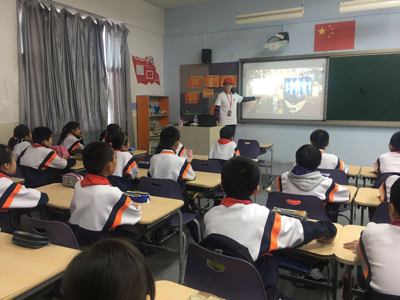

2017年11月23至25日，中国科学院智能科学与技术科普联盟联合首都科技志愿服务联合会、天津中科智能识别产业技术研究院组织开展了“京津冀协同创新志愿服务天津行”活动。本次活动旨在通过科技创新领域交流会、科技型企业走访调研、科普知识进校园等形式，对接当地政府、科技型企业、院校等服务需求，建设京津协同创新志愿服务平台，优化科技创新创业环境。

中国科学院智能科普联盟志愿者们奔赴天津滨海新区，开展了“趣谈机器人”、“感受数据”、“超级计算机的故事”、“遥感技术与应用”、“液体君变形记”、“网络攻防战”六个主题科普活动，给天津市开发区国际学校和开发区第二小学的300余名学生带来了一堂堂别开生面的科普大课。志愿者们用平实的语言、有趣的互动、生动的事例、耐心的引导为学生们传递了中科院前沿科研成果，进一步揭开了科学家与科学故事的神秘面纱，力求宣传科学知识、普及科学常识、激发学习热情、树立科学理念，鼓励他们学习和钻研科学知识，用科技知识更好地建设家乡。

实验室王琦同学作为国科大的唯一一名志愿者前往天津市开发区第二小学，为同学们带来了“感受数据”的报告，以身边存在的数据为切入点，让学生感觉数据无处不在，介绍了当今热门的大数据和数据挖掘方向，点燃了学生的好奇心。随后对数据库的发展历史、现有的数据库软件和数据库的增删改查操作进行了讲解。通过“观电影-共合作-找实体、属性及其联系”的方式，加强了学生对数据库的理解，激发了学生开展数据库实践应用的积极性。

