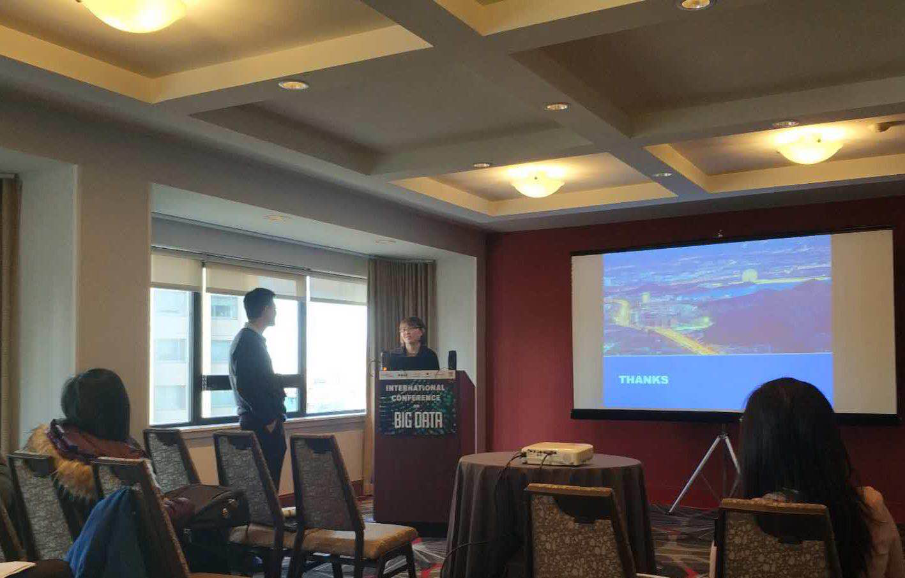

2017年12月11日-14日，IEEE BigData 2017国际会议在美国波士顿如期举行，会议网址http://cci.drexel.edu/bigdata/bigdata2017/。实验室徐俊刚老师及硕士生黄珊珊、刘仁峰同学参加了此次会议。IEEE BigData 全称是IEEE International Conference on BigData，是大数据领域的顶级国际学术会议，会议中Regular Paper录用率近五年都在15%~20%之间，今年的会议有1000多人参会。此外，30多个大数据相关Workshop也同BigData2017会议一同举办。实验室论文“A Novel Compression Algorithm Decision Method for Spark Shuffle Process”被Workshop on Benchmarking, Performance Tuning and Optimization for Big Data Applications (BPOP)接收，黄珊珊同学在会上做了该论文的口头报告，并回答了问题。徐俊刚老师与大会共同主席Xiaoha Tony Hu（胡小华）以及其他知名学者JianYun Nie（聂建云）、Jiaqi Gong（龚嘉琦）等进行了交流。

会议间隙，徐俊刚老师还带领黄珊珊、刘仁峰同学参观了著名学府MIT（麻省理工学院），体验了世界一流名校的学习氛围和科研环境。

