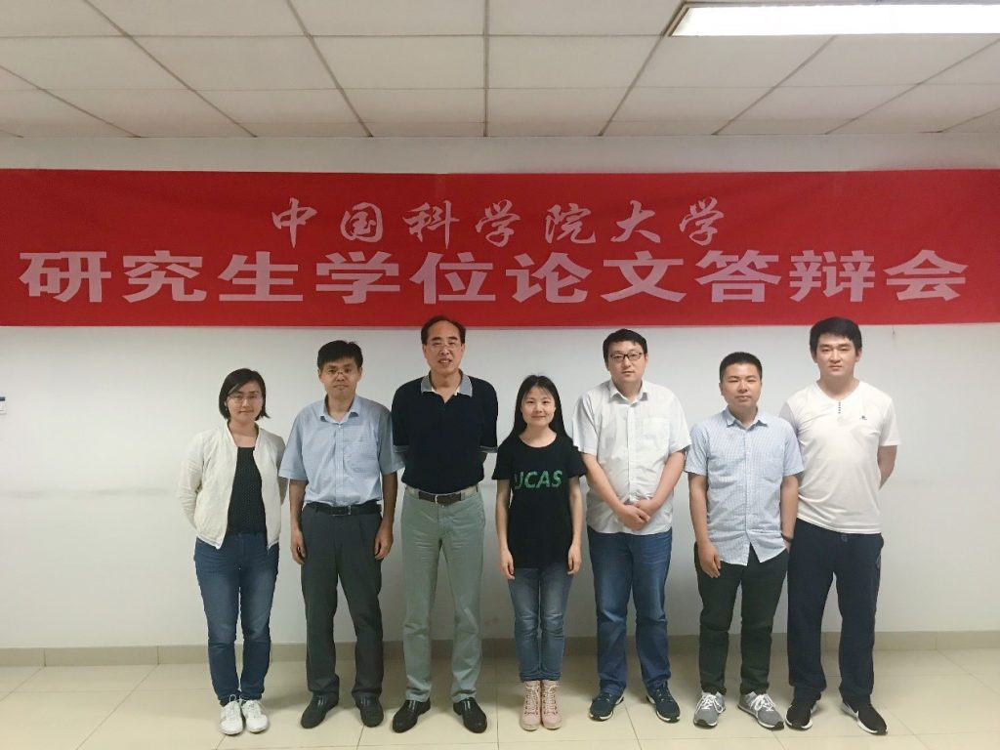

2018年5月16日，实验室在国科大中关村校区举行了王琦、金灿灿同学的硕士论文答辩会，答辩会主席由中国科学院大学孙应飞教授担任，答辩会成员包括徐俊刚、韩先培、何苯、林姝，答辩会秘书李鹏飞。各位专家听取了两位同学的论文报告，经无记名投票，一致同意通过两位同学的硕士论文答辩，并建议授予硕士学位。
对两位同学表示祝贺！

答辩会会后合影： 
封面左起依次为：李鹏飞、林姝、孙应飞、王琦、徐俊刚、何苯、韩先培

