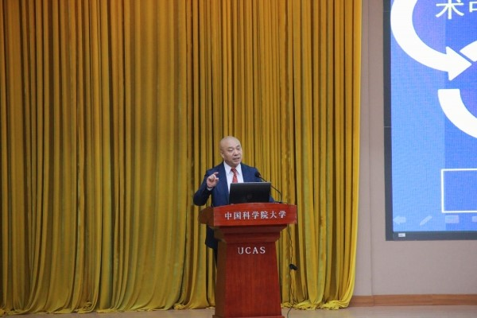

2018年9月22日至23日,“2018中国医学人工智能大会暨第一届人工智能雁栖高端论坛”在中国科学院大学（以下简称“国科大”）雁栖湖校区举行，中国科学院院士、国科大副校长徐涛研究员，中国科学院院士、北京大学程和平教授，IEEE Fellow、国科大计算机与控制学院副院长、中国科学院计算技术研究所副所长陈熙霖研究员，IEEE Fellow、国科大计算机与控制学院副院长黄庆明教授，IEEE Fellow、中国科学院分子影像重点实验室主任田捷研究员，中华医学会放射学分会候任主任委员、上海长征医院影像医学与核医学科主任刘士远教授,浪潮集团副总裁、浪潮健康总裁高传贵，长江学者特聘教授、华西医院副院长龚启勇教授等150多位医学和人工智能领域的专家学者、企业界代表、研究生出席了本次大会。大会由中国人工智能学会、国科大、中国图像图形学学会、中国科学院计算技术研究所共同主办，国科大计算机与控制学院承办，国科大计算机与控制学院徐俊刚教授、中国科学院计算技术研究所赵地副研究员、北京邮电大学张成文副教授为大会主席。
 
徐涛在致辞中谈到，人工智能现在很火，国务院在2017年印发了“新一代人工智能发展规划”，人工智能上升为国家战略。作为新一轮产业变革的核心驱动力，人工智能向各个行业提供了强大的赋能作用。在众多行业中，医学具有数据密集型、知识密集型的特点，是非常有前景的人工智能应用领域，各个国家都很重视人工智能技术在医学领域的布局与应用。从去年到今年，我国也密集出台了许多医学人工智能方面的政策与法规，大大推动了我国医学人工智能产业的发展。
 
徐涛还向与会者介绍了国科大在医学领域的发展情况。他介绍，国科大是一所以“博学笃志，格物明德”为校训、以科教融合为特色的创新型大学。今年正值建校40周年，本次大会也是重要的校庆活动之一。国科大在医学领域也有重大布局，2015年7月成立了存济医学院，由全国人大副委员长、中国科学院副院长丁仲礼院士任理事长；2018年7月，由国科大、中国疾病预防控制中心、中国卫生信息与健康医疗大数据学会三方共同成立了“中国科学院大学健康医疗大数据国家研究院”，共同研究健康医疗大数据采集标准和相关政策法规，培养复合型公共卫生人才。除此之外，国科大生命科学学院与北京大学共建国家生物医学成像设施；国科大计算机与控制学院和人工智能学院都坚持“科教融合、育人为本、协同创新、服务国家”的办学理念，聚焦人工智能领域核心科学和关键技术，面向国际科学前沿，拥有包括智能信息处理、脑认知与智能医学在内的多个教研室和实验室。徐涛说：“值此校庆来临之际，感谢各位与会者的到来。我们希望在医学人工智能方面与在座的各位专家展开深入合作！”

从1950年图灵在《计算机器与智能》一文中提出人工智能与图灵测试以来，人工智能技术取得了长足的发展。2012年，基于深度学习的方法以绝对优势获得ImageNet图像分类竞赛冠军，2016年AlphaGo战胜国际知名围棋棋手李世石，更是确定了人工智能在人类社会发展中的重要地位。人工智能与各领域的结合不断加强，相互促进，推动了许多新兴学科的发展，医学人工智能也应运而生。

**
生物医学大科学装置将落地怀柔科学城
**
“我们希望能够对生命体结构与功能进行跨尺度的可视化描绘与精确测量”，中国科学院院士程和平教授在报告中提到即将在北京怀柔科学城建成的生物医学类大科学装置——多模态跨尺度生物医学成像设施。该设施是在国家发改委、教育部、中国科学院、北京市的大力支持下，联合多家单位与优势力量，共同推动申报与筹建的。该项目在2016年12月被正式列为《国家重大科技基础设施建设“十三五”规划》10个优先建设项目之一，将在北京怀柔科学城集中建设。

从分子到个体，该设施能够根据不同的成像模态获取不同的结构、功能和组成要素，从而更直观地展示相关的生命信息。我们期待着这一宏大项目的竣工，也期待着多模态跨尺度生物医学成像设施为破解生命与疾病的奥秘做出贡献。

该装置所在地——怀柔科学城，坐落于长城脚下、雁栖湖畔。科学城以大科学装置集群和前沿科技交叉研究平台为核心，同时建设四个核心区。其中的科学教育区即包含国科大雁栖湖校区。怀柔科学城的建成，将更加有力地支撑国科大的教学科研工作。

**
人工智能为医学赋能
**
“人工智能的职能是为医生赋能”，南京信息工程大学徐军教授在大会报告中提到。发挥人工智能的优势，提高医疗诊断与治疗的效率和准确率是医学人工智能的出发点与落脚点。

以上海长征医院主任医师刘士远教授报告中提到的肺结节辅助诊断为例，通过大数据的学习，人工智能可以对肺结节CT影像进行智能检测与识别，一方面能够代替医疗人员进行重复性的工作，提高效率，另一方面也能帮助医生提高诊断的准确度。

除了医学影像，人工智能在病例分析、精准手术、药物挖掘、医疗风险分析等方面也起到了重要作用。 清华大学廖宏恩教授研发的微创诊疗机器人，它有定向定位操作，又有可视功能，将来应用空间广阔。

**
人工智能帮助医生看得更清、更远
**
中国科学院分子影像重点实验室主任田捷研究员在报告中提到，通过复杂的非线性运算，人工智能可以“看到”医学影像中更加复杂的一些新特征：小波、纹理、强度、模式……这些特征在人眼看来可能是没有意义的，但是对于深度神经网络来说，这些特征便是医疗诊断的关键，最终将疾病的特性联系起来。对CT、核磁等医疗影像来说，人眼只能识别轮廓、形状、大小这样有明确意义的特征，但对高维度的特征，人眼是无法识别的。同时，影像仪器为了方便医生，会将原始图像进行处理，这个处理过程会导致信息的改变或者损失。如果减少对原始影像的处理步骤，直接将原始的信息交给人工智能去解读、计算、分析，结果将会更加精准。从临床反馈来看，同是结直肠癌的淋巴转移预测，使用人工智能阅片可以将假阳性率从百分之七十降低到百分之三十。

毫无疑问，人工智能能帮助医生看得更清、更远。

**
人工智能助力多模态诊疗
**
在传统影像学里，精神分裂患者的头部CT与MRI等检查结果看起来往往与健康人群无异。因此，医生很难借助传统的影像辅助检查方式帮助确诊，更不必说辅助治疗了。那么，精神分裂患者是否存在可观测的脑部生理结构改变？通过“多模磁共振”技术，华西医院给出了肯定的答案。

华西医院龚启勇副院长在会后访谈中提到，华西医院已经在应用多模磁共振的研究成果，尤其是用于精神疾病患者的诊断与疗效评价。不仅如此，多模磁共振技术还可以识别出各项功能活动对应的脑部区域位置。未来，医学还可能采用靶向电极，精准刺激病变点的方式，对精神疾病进行干预治疗。

据了解，多模磁共振技术的核心便是使用人工智能将不同的影像序列融合在一起，让深度神经网络从多种不同的信息中提取、组合特征，提高诊断的准确率。也就说，面对病情复杂的患者，医生需要大量不同的影像和诊疗报告才能确定病情，然而这个工作量是巨大的，准确率也不一定高。但是有了人工智能的支持，今后只需要将病人的各类核磁图像输入计算机，便可以在短时间内得到一个置信度高的结果。

**
医学人工智能研究中的国科大声音
**
国科大以“科教融合、育人为本、协同创新、服务国家”为办学理念，与中国科学院直属研究机构（包括所、院、台、中心等）在管理体制、师资队伍、培养体系、科研工作等方面高度融合。国科大与全国各地116个培养单位“共建、共治、共享、共赢”。近年来，随着科教融合的不断深化，国科大已依托京内外高水平培养单位成立了38个科教融合学院。

中国科学院深圳先进技术研究院（以下简称“深圳先进院”）是国科大的培养单位之一。国科大研究生导师、深圳先进院研究员梁栋在报告中谈到了传统MRI（磁共振成像）全脑血管壁成像的问题：“传统MRI所需时间较长，对于患者来说始终保持静止较难做到，尤其是对于患有幽闭恐惧症的患者，而轻微的移动又会降低采样的精度。”针对这个问题，梁老师提出了目前课题组的研究方案：通过人工智能算法，缩短了MRI所需时间，并将二维成像转化为三维成像，更加准确与直观地呈现出全脑血管壁的影像。这些研究工作目前已申请了多项专利，其中不少技术已经应用到了临床实践中。

同样，孵化于中国科学院自动化研究所智能医学研究中心的中国科学院分子影像重点实验室也在医学影像领域做出了积极贡献。在实验室主任、国科大博士生导师田捷研究员的带领下，实验室在分子影像、功能影像、医学影像分析与处理、智能医学等相关领域的基础理论研究、关键技术研发、成果推广应用、专业人才培养等方面都取得了丰硕的成果。

无论是医学还是人工智能，或是医学+人工智能，国科大都在积极发出自己的声音，为医疗行业不断注入新的力量。未来，国科大将继续聚焦于人工智能在医学及其他领域的研究与应用，不断探索创新，为解决实际问题提供“国科大方案”。

9月23日下午7点，大会共同主席徐俊刚教授宣布历时两天的“2018中国医学人工智能大会”胜利闭幕。