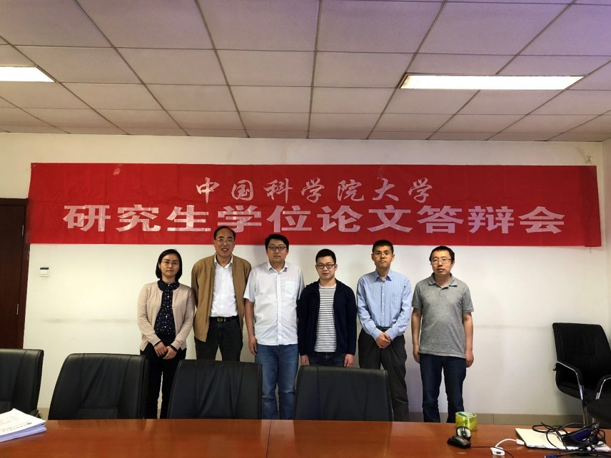
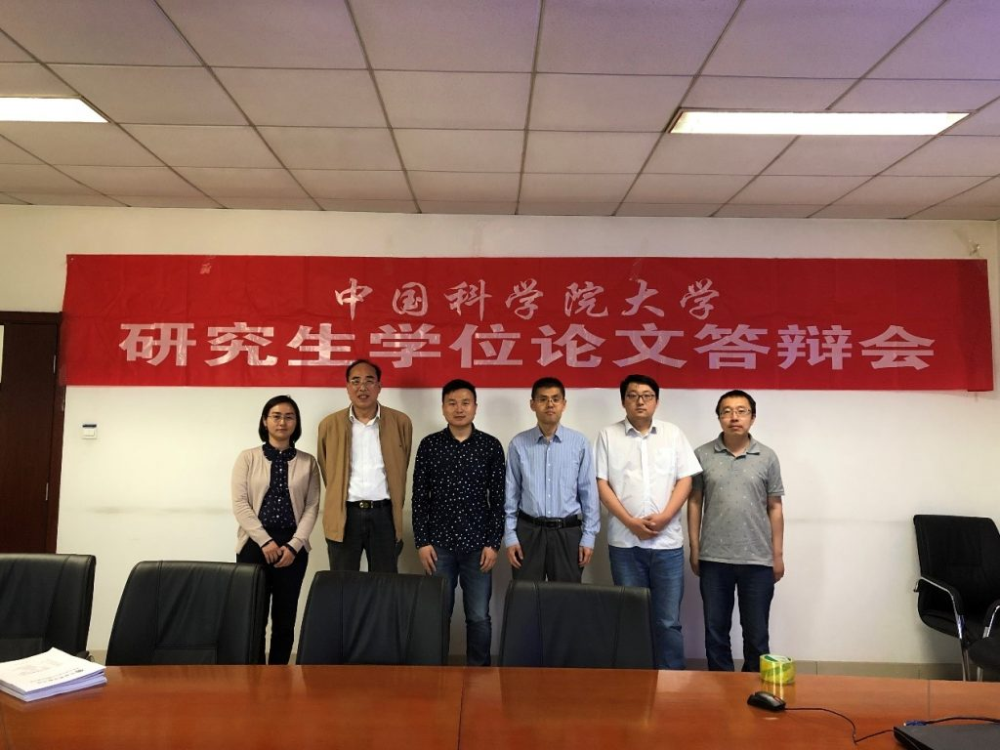

2019年5月13日，实验室在国科大中关村校区举行了刘仁峰、冉晏华、范洋三位同学的硕士论文答辩会，答辩会主席由中国科学院大学孙应飞教授担任，答辩会成员包括徐俊刚、马龙龙、何苯、林姝，答辩会秘书景琨。各位专家听取了三位同学的论文报告，经无记名投票，一致同意通过三位同学的硕士论文答辩，并建议授予硕士学位。
对三位同学表示祝贺！

答辩会会后合影： 
封面左起依次为：林姝、孙应飞、刘仁峰、徐俊刚、何苯、马龙龙

