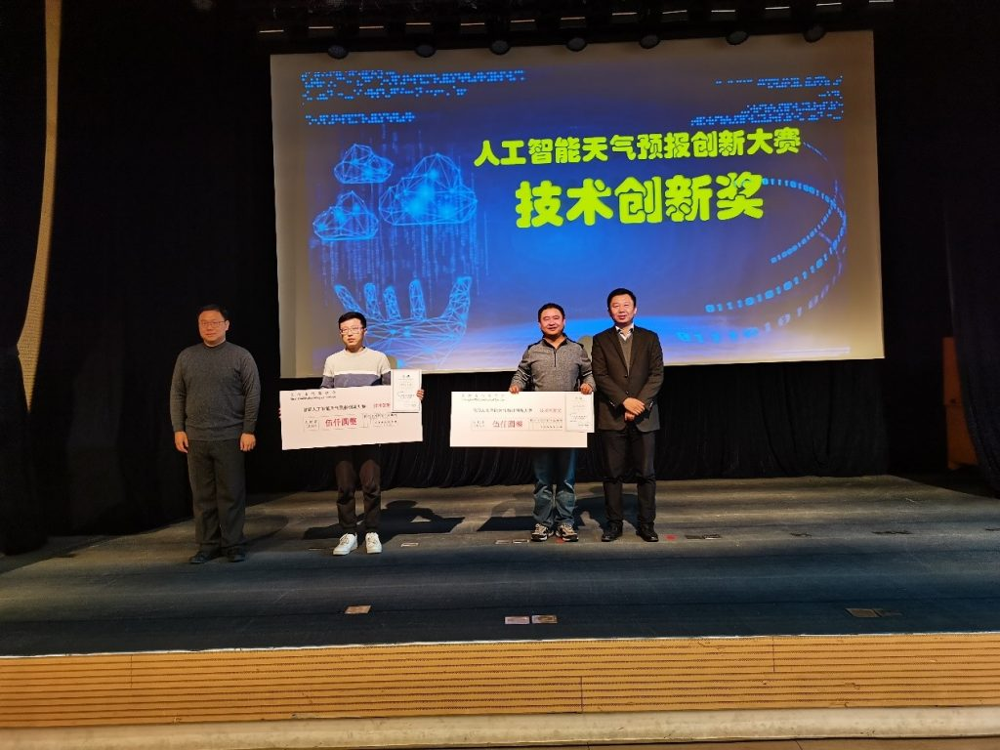

在2020年12月4日结束的2020人工智能天气预报创新大赛中，由实验室博士生景琨、硕士生陈洛宇组成的“CCIP449”队获得二等奖，同时获得技术创新奖，预报成果受到上海市气象局首席预报员戴建华的高度肯定，对两位同学表示祝贺！

此次人工智能天气预报创新大赛由上海市气象学会主办、上海进博会气象台承办，以“智慧气象，服务进博，创新发展，示范引领”为主题，以攻克“降水过程的短临预测”这一国际性难题为目标，将上海及长三角洲地区的历史降水过程为预报对象，根据过去一小时的雷达回波图像数据预测未来2小时的雷达回波（反映降水情况）图像的连续变化。此次大赛参赛队伍有100多支，最后初赛成绩最好的10支队伍进入决赛。

