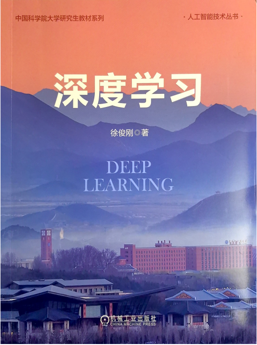

**教学名称**:	深度学习 
**开课学院**:	计算机科学与技术学院 
**学生人数**:	1000人以上 
**上课时间**:	春季学期 
**上课地点**:	雁栖湖校区 
**教学用书**:	徐俊刚. 深度学习. 北京: 机械工业出版社, 2024. 勘误，[目录](./深度学习封面与目录.pdf)   &nbsp; &nbsp; &nbsp; &nbsp; &nbsp; &nbsp; &nbsp;&nbsp; 如选用此教材，课件请联系徐俊刚老师：xujg@ucas.ac.cn 

**首席教授**:	徐俊刚教授 
**教学组老师**:	张新峰副教授，万方副教授   
**课程名称**:	高级数据管理 
**开课学院**:	计算机科学与技术学院 
**学生人数**:	100人左右 
**上课时间**:	春季学期 
**上课地点**:	雁栖湖校区 
**教学用书**:	暂无 
**首席教授**:	徐俊刚教授 
**教学组成员**:	赖心华博士 
